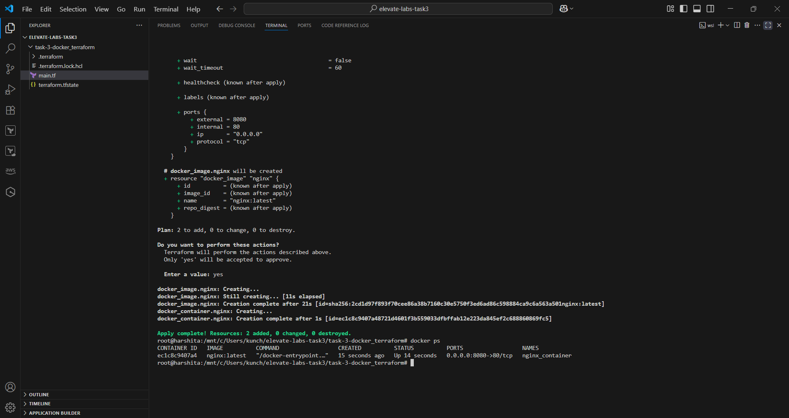
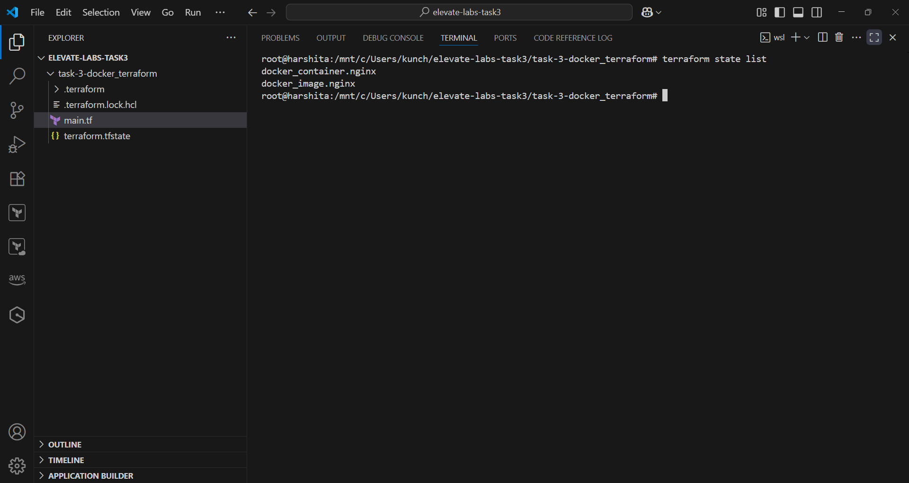
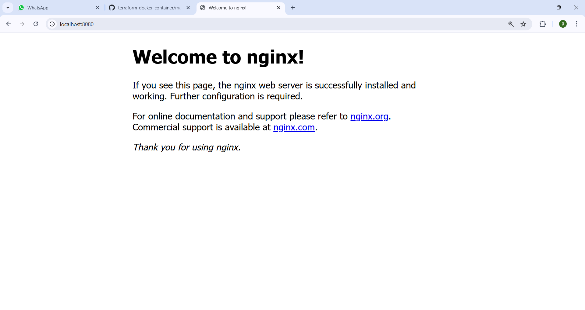

# 🚀 Task 3 – Provision Docker Container using Terraform

## 🎯 Objective
Provision a local Docker container using **Terraform** as Infrastructure as Code (IaC).

---

## 🧰 Tools Used
- [Terraform](https://developer.hashicorp.com/terraform/downloads)
- [Docker Desktop](https://www.docker.com/products/docker-desktop/)
- Visual Studio Code

---

## ⚙️ Prerequisites
Make sure the following tools are installed on your system:

1. **Terraform** (v1.x or above)  
   - Verify: `terraform -v`

2. **Docker** (Docker Desktop or Docker Engine)  
   - Verify: `docker --version`
   - Docker service must be running
     - Verify: `systemctl status docker`

---

## 📁 Project Structure

| File/Folder                 | Description                                      |
|-----------------------------|--------------------------------------------------|
| `main.tf`                   | Main Terraform configuration file                |
| `logs/`                     | Folder containing execution logs                 |
| `logs/init-log.txt`         | Output of `terraform init`                       |
| `logs/apply-log.txt`        | Output of `terraform apply`                      |
| `logs/destroy-log.txt`      | Output of `terraform destroy`                    |
| `screenshots/`              | Folder containing screenshots                    |
| `README.md`                 | Documentation with steps                         |

---

## Steps to run

- Initialize Terraform 
 `terraform init | tee logs/init-log.txt`
- Preview Changes
  `terraform plan`
- Apply the Configuration
  `terraform apply | tee logs/apply-log.txt`
- Verify Container is Running
  `docker ps`
 -You should see a container named nginx_container with PORTS like 0.0.0.0:8080->80/tcp.
- Check Browser :-
  `Open: http://localhost:8080`
   - You should see the NGINX welcome page.
- Destroy Resources
   `terraform destroy | tee logs/destroy-log.txt`

---

## 🔍 Terraform State Management
- Check current Terraform state:
 `terraform state list`

- View detailed resource info:
 `terraform show`

The Terraform state file (terraform.tfstate) tracks resource metadata and helps Terraform manage lifecycle operations efficiently.
 
 --- 

## 🎓 Key Learnings

- Understanding Infrastructure as Code (IaC) principles.
- Practical experience with Terraform providers and resources.
- Working knowledge of Terraform commands and lifecycle.
- Managing Docker containers declaratively.
- Importance and usage of Terraform state in resource tracking.

---

## 📸 Output Screenshots
 
1. docker-ps-verification - Output of docker ps showing running container
  

2. Showing Terraform State list
  

3. NGINX running on browser
  

 ---

## 🙋‍♀️ Contact

Made by Nikki Goyal

GitHub: https://github.com/devops-nikki

LinkedIn: https://www.linkedin.com/in/nikki-goyal-devops

